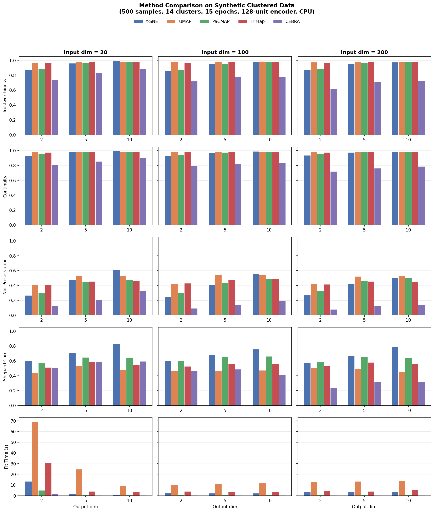

# Overview
Multi-method parametric dimensionality reduction using PyTorch. Train a neural network to learn a low-dimensional embedding, then reuse the trained model to transform new data relatively quickly.

Supported methods: **t-SNE**, **UMAP**, **PaCMAP**, **TriMap**, and **CEBRA**. All methods share a common API (sklearn-compatible fit/transform) and support custom encoder architectures, optional PCA preprocessing, and model serialization. A **TemporalMixin** adds temporal smoothness regularization to any method.

By default the encoder is a dense network with layers [input_dim, 500, 500, 2000, output_dim], following van der Maaten 2009<sup>1</sup>.

# Installation

```commandline
git clone git@github.com:jsilter/parametric_dr.git
cd parametric_dr
pip install -e .
```

# Usage

Simple example usage may be:

```python
from parametric_dr import Parametric_tSNE

train_data = load_my_training_data()

high_dims = train_data.shape[1]
num_outputs = 2
perplexity = 30
ptSNE = Parametric_tSNE(high_dims, num_outputs, perplexity)
ptSNE.fit(train_data)
output_res = ptSNE.transform(train_data)
```

`output_res` will be `N x num_outputs`, the transformation of each point.
At this point, `ptSNE` will be a trained model, so we can quickly transform other data:

```python
test_data = load_my_test_data()
test_res = ptSNE.transform(test_data)
```

See the [examples/](./examples/) directory for complete scripts comparing methods on various datasets:

- **example_synthetic_clusters.py** - Synthetic clustered data in 14 dimensions; compares all methods including temporal variants
- **example_digits.py** - sklearn handwritten digits (64 features, 10 classes)
- **example_olivetti_faces.py** - Olivetti face images (4096 features, 40 individuals)
- **example_lorenz.py** - Lorenz attractor projected to 20 dimensions; static vs temporal methods
- **example_neural_timecourse.py** - Simulated place cell population on a circular track
- **example_hematopoiesis.py** - Paul et al. 2015 scRNA-seq differentiation data (requires scanpy)

Each example trains multiple methods, computes quality metrics (trustworthiness, continuity, neighborhood preservation, Shepard correlation), reports fit times, and generates a multi-page PDF with visualizations.

To use a custom encoder architecture, pass a PyTorch `nn.Module`:

```python
from parametric_dr import Parametric_tSNE
import torch.nn as nn

train_data = load_my_training_data()
high_dims = train_data.shape[1]
num_outputs = 2
perplexity = 30

encoder = nn.Sequential(
    nn.Linear(high_dims, 128),
    nn.ReLU(),
    nn.Linear(128, 128),
    nn.ReLU(),
    nn.Linear(128, num_outputs),
)
ptSNE = Parametric_tSNE(high_dims, num_outputs, perplexity, encoder=encoder)
```

PCA preprocessing is enabled by default (`n_pca=50`) and automatically skipped when the input dimensionality is already <= 50. Set `n_pca=None` to disable it.

## Method comparison

Benchmark on synthetic clustered data (500 samples, 14 clusters, 15 training epochs, 3-layer encoder with 128 hidden units, no PCA preprocessing). Quality metrics computed on training data with k=10. Fit times measured on CPU.

**Metrics:** Trustworthiness (T), Continuity (C), Neighborhood Preservation (N), and Shepard Correlation (S). See [docs/metrics.md](docs/metrics.md) for definitions and interpretation.



<details>
<summary>Full results tables</summary>

### Output dimensionality: 2

| Method | Input Dim | Trustworthiness | Continuity | Nbr Preservation | Shepard Corr | Fit Time (s) |
|:-------|----------:|:---------------:|:----------:|:----------------:|:------------:|:------------:|
| t-SNE  |        20 |           0.872 |      0.933 |            0.268 |        0.604 |         13.5 |
| UMAP   |        20 |           0.972 |      0.978 |            0.412 |        0.442 |         69.5 |
| PaCMAP |        20 |           0.889 |      0.955 |            0.303 |        0.568 |          5.0 |
| TriMap |        20 |           0.967 |      0.977 |            0.414 |        0.513 |         30.7 |
| CEBRA  |        20 |           0.737 |      0.813 |            0.131 |        0.506 |          2.2 |
| t-SNE  |       100 |           0.859 |      0.929 |            0.251 |        0.600 |          2.5 |
| UMAP   |       100 |           0.977 |      0.978 |            0.427 |        0.470 |          9.9 |
| PaCMAP |       100 |           0.877 |      0.949 |            0.301 |        0.599 |          0.8 |
| TriMap |       100 |           0.972 |      0.978 |            0.431 |        0.527 |          4.1 |
| CEBRA  |       100 |           0.719 |      0.793 |            0.092 |        0.464 |          0.4 |
| t-SNE  |       200 |           0.873 |      0.936 |            0.271 |        0.572 |          3.6 |
| UMAP   |       200 |           0.975 |      0.978 |            0.420 |        0.510 |         12.6 |
| PaCMAP |       200 |           0.890 |      0.959 |            0.325 |        0.583 |          0.9 |
| TriMap |       200 |           0.973 |      0.976 |            0.415 |        0.537 |          4.3 |
| CEBRA  |       200 |           0.612 |      0.720 |            0.079 |        0.238 |          0.5 |

### Output dimensionality: 5

| Method | Input Dim | Trustworthiness | Continuity | Nbr Preservation | Shepard Corr | Fit Time (s) |
|:-------|----------:|:---------------:|:----------:|:----------------:|:------------:|:------------:|
| t-SNE  |        20 |           0.961 |      0.982 |            0.476 |        0.713 |          1.8 |
| UMAP   |        20 |           0.983 |      0.983 |            0.527 |        0.530 |         24.8 |
| PaCMAP |        20 |           0.969 |      0.981 |            0.446 |        0.646 |          0.6 |
| TriMap |        20 |           0.977 |      0.980 |            0.454 |        0.585 |          4.1 |
| CEBRA  |        20 |           0.832 |      0.854 |            0.207 |        0.587 |          0.5 |
| t-SNE  |       100 |           0.952 |      0.974 |            0.411 |        0.684 |          2.3 |
| UMAP   |       100 |           0.984 |      0.983 |            0.541 |        0.471 |         11.2 |
| PaCMAP |       100 |           0.958 |      0.977 |            0.435 |        0.659 |          0.7 |
| TriMap |       100 |           0.981 |      0.981 |            0.479 |        0.561 |          3.9 |
| CEBRA  |       100 |           0.784 |      0.818 |            0.141 |        0.488 |          0.4 |
| t-SNE  |       200 |           0.949 |      0.976 |            0.423 |        0.671 |          3.7 |
| UMAP   |       200 |           0.983 |      0.982 |            0.523 |        0.489 |         13.4 |
| PaCMAP |       200 |           0.967 |      0.982 |            0.467 |        0.658 |          0.8 |
| TriMap |       200 |           0.978 |      0.979 |            0.456 |        0.579 |          4.1 |
| CEBRA  |       200 |           0.707 |      0.764 |            0.128 |        0.315 |          0.4 |

### Output dimensionality: 10

| Method | Input Dim | Trustworthiness | Continuity | Nbr Preservation | Shepard Corr | Fit Time (s) |
|:-------|----------:|:---------------:|:----------:|:----------------:|:------------:|:------------:|
| t-SNE  |        20 |           0.989 |      0.993 |            0.608 |        0.826 |          0.8 |
| UMAP   |        20 |           0.984 |      0.983 |            0.533 |        0.478 |          8.9 |
| PaCMAP |        20 |           0.982 |      0.984 |            0.481 |        0.639 |          0.6 |
| TriMap |        20 |           0.979 |      0.981 |            0.466 |        0.553 |          3.4 |
| CEBRA  |        20 |           0.891 |      0.904 |            0.324 |        0.593 |          0.5 |
| t-SNE  |       100 |           0.983 |      0.989 |            0.553 |        0.757 |          2.3 |
| UMAP   |       100 |           0.985 |      0.982 |            0.546 |        0.473 |         11.7 |
| PaCMAP |       100 |           0.977 |      0.984 |            0.495 |        0.662 |          0.9 |
| TriMap |       100 |           0.981 |      0.980 |            0.488 |        0.558 |          3.9 |
| CEBRA  |       100 |           0.784 |      0.835 |            0.195 |        0.408 |          0.5 |
| t-SNE  |       200 |           0.975 |      0.985 |            0.508 |        0.794 |          3.6 |
| UMAP   |       200 |           0.982 |      0.982 |            0.524 |        0.457 |         13.6 |
| PaCMAP |       200 |           0.979 |      0.984 |            0.499 |        0.639 |          0.9 |
| TriMap |       200 |           0.979 |      0.979 |            0.453 |        0.563 |          5.6 |
| CEBRA  |       200 |           0.726 |      0.788 |            0.141 |        0.317 |          0.4 |

</details>

**Key observations:**
- **UMAP** and **TriMap** achieve the highest T/C scores but are the slowest to train (UMAP builds a fuzzy simplicial set; TriMap constructs triplets).
- **t-SNE** has the best Shepard correlation (global structure preservation), especially at higher output dimensions.
- **PaCMAP** offers a good balance of quality and speed across all settings.
- **CEBRA** is designed for temporal/behavioral data; on this static clustering task (with synthetic sequential indices) it underperforms the other methods, which is expected.
- All methods improve with higher output dimensionality, but t-SNE benefits the most (its Shepard correlation jumps from ~0.6 at dim=2 to ~0.8 at dim=10).

## t-SNE notes

The `perplexity` parameter can also be a list (e.g. `[10, 20, 30, 50, 100, 200]`), in which case the total loss is a sum over each perplexity value. This multiscale approach is inspired by Lee et al. 2014. Initialization time scales linearly with the number of perplexity values, though inference speed is unaffected.

The default output layer is linear rather than ReLU (as in van der Maaten 2009<sup>1</sup>); ReLU occasionally produced degenerate embeddings with all-zero dimensions.

# References

```json
[
  {
    "method": "t-SNE (parametric)",
    "authors": "van der Maaten, L.",
    "year": 2009,
    "title": "Learning a Parametric Embedding by Preserving Local Structure",
    "venue": "AISTATS",
    "url": "https://proceedings.mlr.press/v5/maaten09a.html"
  },
  {
    "method": "t-SNE",
    "authors": "van der Maaten, L.J.P. and Hinton, G.E.",
    "year": 2008,
    "title": "Visualizing Data using t-SNE",
    "venue": "Journal of Machine Learning Research, 9(86), 2579-2605",
    "url": "https://www.jmlr.org/papers/v9/vandermaaten08a.html"
  },
  {
    "method": "t-SNE (multiscale)",
    "authors": "Lee, J.A., Peluffo-Ordonez, D.H., and Verleysen, M.",
    "year": 2014,
    "title": "Multiscale Stochastic Neighbor Embedding: Towards Parameter-Free Dimensionality Reduction",
    "venue": "ESANN 2014",
    "url": "https://www.researchgate.net/publication/282294984"
  },
  {
    "method": "UMAP",
    "authors": "McInnes, L., Healy, J., and Melville, J.",
    "year": 2018,
    "title": "UMAP: Uniform Manifold Approximation and Projection for Dimension Reduction",
    "venue": "arXiv:1802.03426",
    "url": "https://arxiv.org/abs/1802.03426"
  },
  {
    "method": "PaCMAP",
    "authors": "Wang, Y., Huang, H., Rudin, C., and Shaposhnik, Y.",
    "year": 2021,
    "title": "Understanding How Dimension Reduction Tools Work: An Empirical Approach to Deciphering t-SNE, UMAP, TriMap, and PaCMAP for Data Visualization",
    "venue": "Journal of Machine Learning Research, 22(201), 1-73",
    "url": "https://jmlr.org/papers/v22/20-1061.html"
  },
  {
    "method": "TriMap",
    "authors": "Amid, E. and Warmuth, M.K.",
    "year": 2019,
    "title": "TriMap: Large-scale Dimensionality Reduction Using Triplets",
    "venue": "arXiv:1910.00204",
    "url": "https://arxiv.org/abs/1910.00204"
  },
  {
    "method": "CEBRA",
    "authors": "Schneider, S., Lee, J.H., and Mathis, M.W.",
    "year": 2023,
    "title": "Learnable Latent Embeddings for Joint Behavioural and Neural Analysis",
    "venue": "Nature, 617, 360-368",
    "doi": "10.1038/s41586-023-06031-6",
    "url": "https://www.nature.com/articles/s41586-023-06031-6"
  }
]
```

